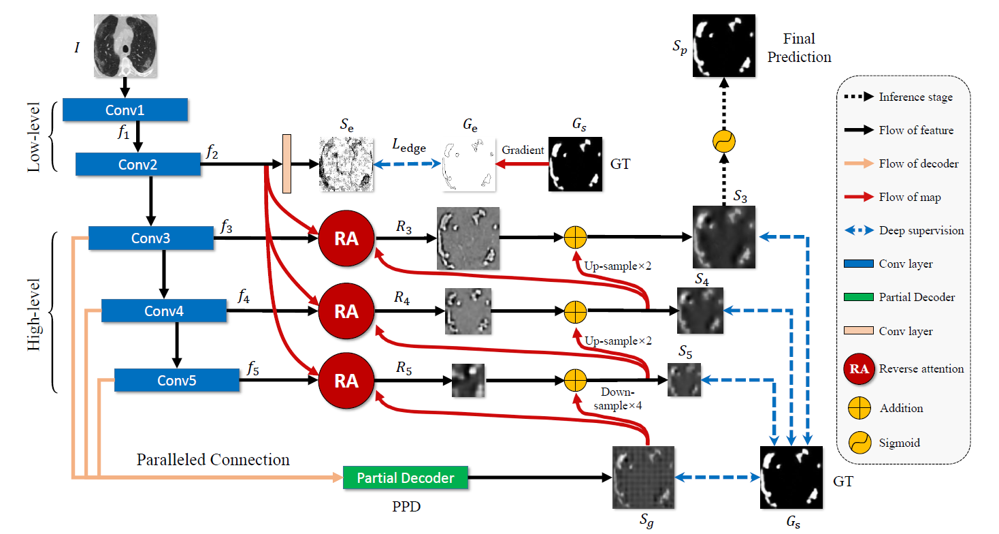
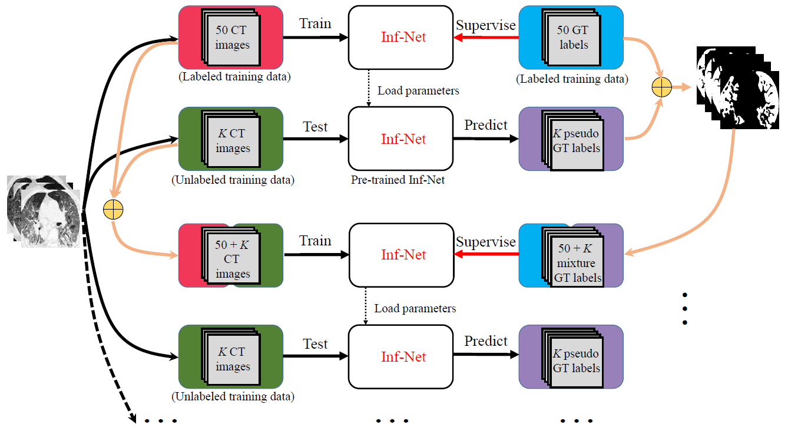
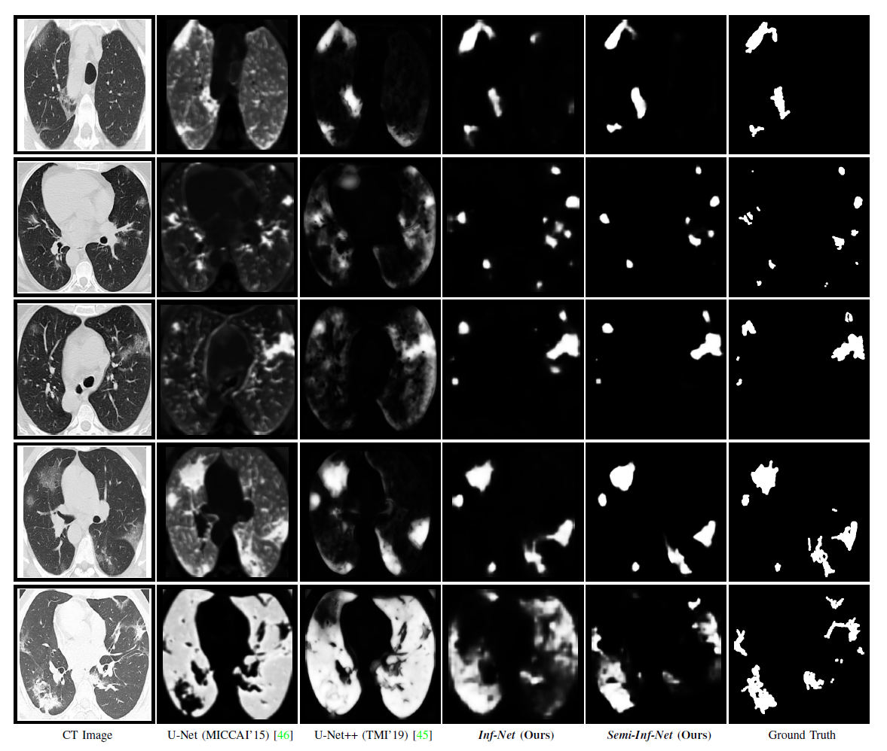
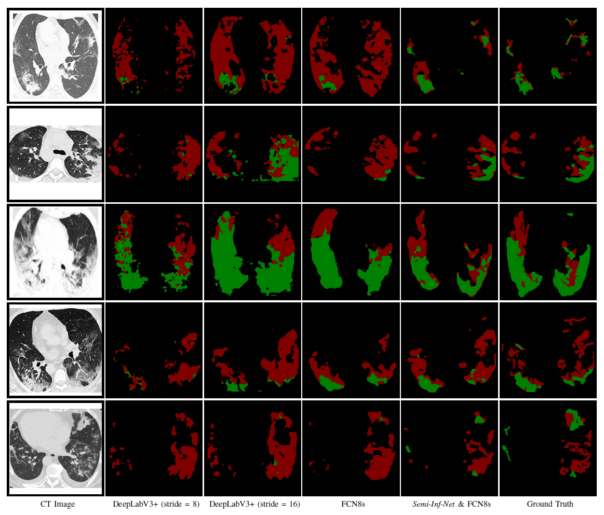

# Inf-Net: Automatic COVID-19 Lung Infection Segmentation from CT Scans

> **Authors:** 
> [Deng-Ping Fan](https://dpfan.net/), 
> [Tao Zhou](https://taozh2017.github.io/), 
> Ge-Peng Ji, 
> Yi Zhou, 
> [Geng Chen](https://www.researchgate.net/profile/Geng_Chen13), 
> [Huazhu Fu](http://hzfu.github.io/), 
> [Jianbing Shen](http://iitlab.bit.edu.cn/mcislab/~shenjianbing), and 
> [Ling Shao](http://www.inceptioniai.org/).

- This repository provides code for "_**Inf-Net: Automatic COVID-19 Lung Infection Segmentation from CT Scans**_" submit to TMI-2020. 
([arXiv Pre-print](https://arxiv.org/abs/2004.14133) & [medrXiv](https://www.medrxiv.org/content/10.1101/2020.04.22.20074948v1))

- Any questions please contact to [Ge-Peng Ji](gepengai.ji@gmail.com) or [Deng-Ping Fan](dengpfan@gmail.com) via E-mail.

## 1. Introduction

### 1.1. Task Description

      
    <em> 
    Figure 1. Example of COVID-19 infected regions in CT axial slice, where the red and green masks denote the 
    ground-glass opacity (GGO) and consolidation, respectively. The images are collected from [1].
    </em>

> [1] COVID-19 CT segmentation dataset, link: https://medicalsegmentation.com/covid19/, accessed: 2020-04-11.

## 2. Proposed Methods

- **Preview:**

    Our proposed methods consist of three individual components under three different settings: 

    - Inf-Net (Supervised Learning with segmentation and edge supervision).
    
    - Semi-Inf-Net (Semi-supervised learning with doctor label and pseudo label)
    
    - Semi-Inf-Net + Multi-Class UNet (Extended to Multi-class Segmentation, including Background, Ground-glass Opacities, and Consolidation).
   
- **Dataset Preparation:**

    Firstly, you should download the testing/training set ([Google Drive Link](https://drive.google.com/open?id=1bbKAqUuk7Y1q3xsDSwP07oOXN_GL3SQM)) 
    and put it into `./Dataset/` repository.

- **Download the Pretrained Model:**

    ImageNet Pre-trained Models used in our paper (
    [VGGNet16](https://download.pytorch.org/models/vgg16-397923af.pth), 
    [ResNet](https://download.pytorch.org/models/resnet50-19c8e357.pth), and 
    [Res2Net](https://shanghuagao.oss-cn-beijing.aliyuncs.com/res2net/res2net50_v1b_26w_4s-3cf99910.pth)), 
    and put them into `./Snapshots/pre_trained/` repository.

- **Configuring your environment (Prerequisites):**

    Note that Inf-Net series is only tested on Ubuntu OS 16.04 with the following environments (CUDA-10.0). 
    It may work on other operating systems as well but we do not guarantee that it will.
    
    + Creating a virtual environment in terminal: `conda create -n SINet python=3.6`.
    
    + Installing necessary packages: `pip install -r requirements.txt`.

### 2.1. Inf-Net

#### 2.1.1 Overview

      
    <em> 
    Figure 2. The architecture of our proposed Inf-Net model, which consists of three reverse attention 
    (RA) modules connected to the paralleled partial decoder (PPD).
    </em>

#### 2.1.2. Usage

1. Train

    - Add your in `MyTrain_LungInf.py`, and turn off the semi-supervised mode in the parser (`--is_semi=False`)

    - Just run it!

1. Test
    
    - When training is completed, the weights will be saved in `./Snapshots/save_weights/Inf-Net/`. 
    You also can directly download the pre-trained weights from [Google Drive]().
    
    - Assign the path `--pth_path` of trained weights and `--save_path` of results save and in `MyTest_LungInf.py`.
    
    - Just run it and results will be saved in `./Results/Lung infection segmentation/Inf-Net`

### 2.2. Semi-Inf-Net

#### 2.2.1. Overview

      
    <em> 
    Figure 3. Overview of the proposed Semi-supervised Inf-Net framework.
    </em>

#### 2.2.2. Usage

1. Data Preparation (Optional)
    
    Dividing the unlabeled image into multiple groups (1600/5=320 groups), in which images with 
    `*.jgp` format can be downloaded from [Google Drive](). You should copy them into 
    `./Dataset/TrainingSet/LungInfection-Train/Pseudo-label/Split/Imgs`. Then you only just run the the code stored 
    in `./SrcCode/utils/split_1600.py` to prepare sub-dataset used in the training process of pseudo-label generation. 
    **You can also skip this process and download them from [Google Drive]() that is used in our implementation.** 
    Note that all the images are stored in `./Dataset/TrainingSet/LungInfection-Train/Pseudo-label/Split/`

1. Generating Pseudo Labels (Optional)

    - run `PseudoGenerator.py`

1. Train

    - run `MyTrain_LungInf.py`

1. Test
    
    - When training is completed, the weights will be saved in `./Snapshots/save_weights/Semi-Inf-Net/`. 
    You also can directly download the pre-trained weights from [Google Drive]().
    
    - run `MyTest_MulClsLungInf_UNet.py`

### 2.3. Semi-Inf-Net + UNet

#### 2.3.1. Overview

#### 2.3.2. Usage

- Pre-trained Model

    Coming soon ...

## 3. Evaluation Toolbox

### 3.1. Introduction

We provide one-key evaluation toolbox for LungInfection Segmentation tasks, including Lung-Infection and Multi-Class-Infection. 

Google Drive: https://drive.google.com/open?id=1BGUUmrRPOWPxdxnawFnG9TVZd8rwLqCF

### 3.2. Usage

- Prerequisites: MATLAB Software (Windows/Linux OS is both work, however we suggest you test it in the Linux OS for convenience.)

- run `cd ./Evaluation/` and `matlab` open the matlab software via terminal

- Just run `main.m` to get the overall evaluation results.

- Edit the parameters in the `main.m` to evaluate your custom methods. Please refer to the instructions in the `main.m`

## 4. COVID-SemiSeg Dataset

We also build a semi-supervised COVID-19 infection segmentation (**COVID-SemiSeg**) dataset, with 100 labeled CT scans 
from the COVID-19 CT Segmentation dataset [1] and 1600 unlabeled images from the COVID-19 CT Collection dataset [2]. 
Our COVID-SemiSeg Dataset can be downloaded at [Google Drive](https://drive.google.com/open?id=1bbKAqUuk7Y1q3xsDSwP07oOXN_GL3SQM) 

> [1]“COVID-19 CT segmentation dataset,” https://medicalsegmentation.com/covid19/, accessed: 2020-04-11.
> [2]J. P. Cohen, P. Morrison, and L. Dao, “COVID-19 image data collection,” arXiv, 2020.

### 3.1. Training set

1. Lung infection which consists of 50 labels by doctors (Doctor-label) and 1600 pesudo labels generated (Pesudo-label) by our Semi-Inf-Net model. 
Download: http://dpfan.net/wp-content/uploads/LungInfection-Train.zip

2. Multi-Class lung infection which also composed of 50 multi-class labels (GT) by doctors and 50 lung infection labels (Prior) generated by our Semi-Inf-Net model. 
Download: http://dpfan.net/wp-content/uploads/MultiClassInfection-Train.zip

### 3.2. Testing set

1. The Lung infection segmentation set contains 48 images associate with 48 GT.
Download: http://dpfan.net/wp-content/uploads/LungInfection-Test.zip

2. The Multi-Class lung infection segmentation set has 48 images and 48 GT.
Download: http://dpfan.net/wp-content/uploads/MultiClassInfection-Test.zip

## 4. Results

To compare the infection regions segmentation performance, we consider the two state-of-the-art models U-Net and U-Net++. We also show the multi-class infection labeling results in Fig. 5. As can be observed, our model, Semi-Inf-Net & FCN8s, consistently performs the best among all methods. It is worth noting that both GGO and consolidation infections are accurately segmented by Semi-Inf-Net & FCN8s, which further demonstrates the advantage of our model. In contrast, the baseline methods, DeepLabV3+ with different strides and FCNs, all obtain unsatisfactory results, where neither GGO and consolidation infections can be accurately segmented.    
Overall results: http://dpfan.net/wp-content/uploads/COVID-SemiSeg-Results.zip

### 4.1. Download link:

Lung infection segmentation results: http://dpfan.net/wp-content/uploads/Lung-infection-segmentation.zip  
Multi-class lung infection segmentation: http://dpfan.net/wp-content/uploads/Multi-class-lung-infection-segmentation.zip

## 5. Visualization Results:

      
    <em> 
    Figure 4. Visual comparison of lung infection segmentation results.
    </em>

      
    <em> 
    Figure 5. Visual comparison of multi-class lung infection segmentation results, where the red and green labels 
    indicate the GGO and consolidation, respectively.
    </em>

## 6. Paper list of COVID-19 related (update continue)
https://github.com/HzFu/COVID19_imaging_AI_paper_list

## 7. Manuscript
http://dpfan.net/wp-content/uploads/2020TMISubmissionInfNet.pdf

## 8. Citation

Please cite our paper if you find the work useful: 

	@article{fan2020InfNet,
  	title={Inf-Net: Automatic COVID-19 Lung Infection Segmentation from CT Scans},
  	author={Fan, Deng-Ping and Zhou, Tao and Ji, Ge-Peng and Zhou, Yi and Chen, Geng and Fu, Huazhu and Shen, Jianbing and Shao, Ling},
  	Journal = {arXiv},
  	year={2020}
	}
 
 ## 9. Acknowledgements
 
 We thanks [xxx]() for their contributions.
